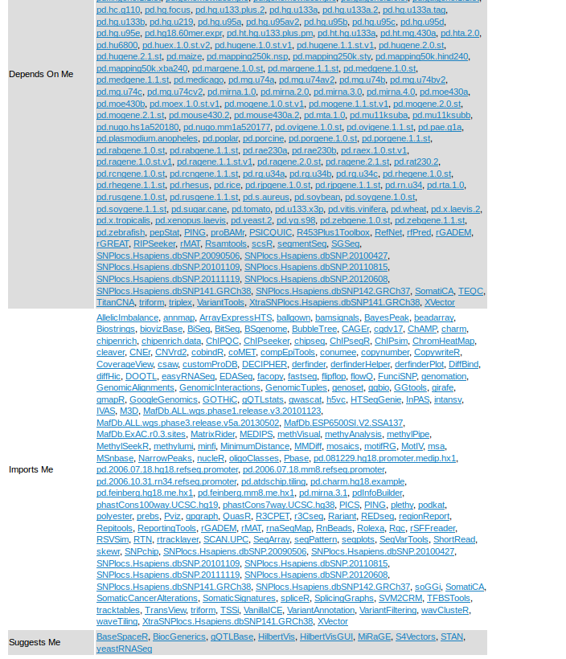
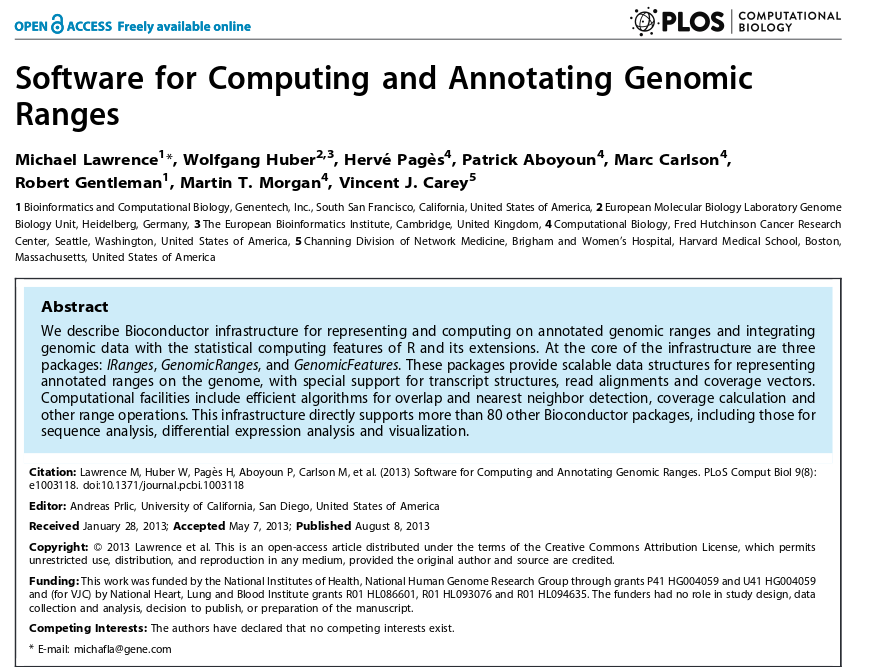
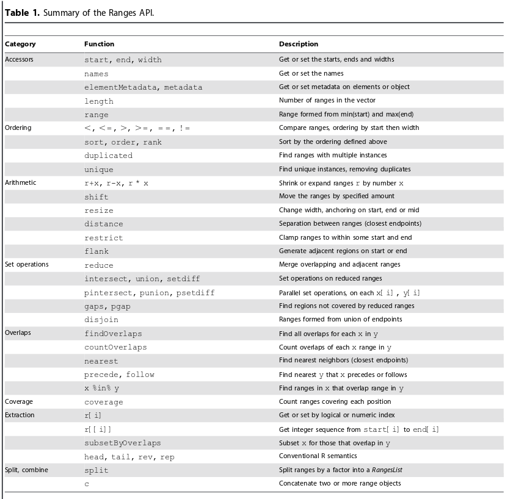
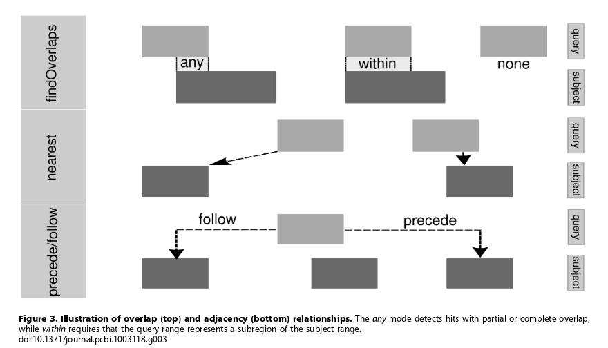

# Overview

## Aims

- By the end of this session you should be familiar with
- How to create and compare genomic intervals
- How DNA sequences are represented in R
- How to read bam files into R
- Interactions between the packages

## Something

Need consistent representation of the genome and reads

```{r echo=FALSE}
suppressPackageStartupMessages(library(GenomicRanges))
suppressPackageStartupMessages(library(Gviz))
suppressPackageStartupMessages(library(BSgenome.Hsapiens.UCSC.hg18))
suppressPackageStartupMessages(library(GenomicAlignments))
library(RColorBrewer)
mybam <- "exampleData/HG00096.chr22.bam"
gr <- GRanges("22", IRanges(start = 33451818, end=33842866))
bam.sub2 <- readGAlignments(file=mybam,use.names=TRUE, param=ScanBamParam(which=gr,what="seq"))

bam.sub2 <- renameSeqlevels(bam.sub2, c("22" = "chr22"))

reads <- lapply(1:6, function(x) AnnotationTrack(GRanges("chr22", IRanges(start(bam.sub2[x]),end(bam.sub2[x]))),name=paste("Read",x,sep="")))
strack <- SequenceTrack(Hsapiens, chromosome = "chr22",name="Genome")
tracks <- reads
tracks <- c(reads, strack)

plotTracks(tracks)
```


##
Often we are given the mapped location of reads

```{r echo=FALSE}
gtrack <- GenomeAxisTrack()
tracks <- c(gtrack,reads, strack)
plotTracks(tracks)
```

- Need a way of representing alignments and associated qualities


## Associating with Genomic Features

- We will often want to find information about the genomic region around the reads
    + genes, transcripts, exons
    + genomic sequence
    
```{r echo=FALSE}
suppressPackageStartupMessages(library(TxDb.Hsapiens.UCSC.hg19.knownGene))
txdb <- TxDb.Hsapiens.UCSC.hg19.knownGene::TxDb.Hsapiens.UCSC.hg19.knownGene
genetrack <- GeneRegionTrack(txdb, chromosome="chr22",start = 33451818,end=33842866)
tracks <- c(gtrack, reads, genetrack)

plotTracks(tracks)
```


## Or use definitions of genomic regions to interrogate the data

```{r echo=FALSE}
bamFile <- system.file("extdata/test.bam", package = "Gviz")


suppressPackageStartupMessages(library(pasillaBamSubset))
suppressPackageStartupMessages(library(Rsamtools))
mybam <- untreated3_chr4()

dTrack4 <- DataTrack(range = untreated3_chr4(), genome = "dm3",
 type = "l", name = "Coverage", window = -1, chromosome = "chr4")

library(TxDb.Dmelanogaster.UCSC.dm3.ensGene)

txdb <- TxDb.Dmelanogaster.UCSC.dm3.ensGene

txTr <- GeneRegionTrack(txdb, chromosome="chr4", genome="dm3",start = 2266,end=51954)
plotTracks(list(dTrack4,txTr),from=2266,to=51954 )
```

Need representation of genomic regions of interest


# Core data-type 1: Genome Intervals

## IRanges

- A Genome is typically represented as linear sequence
- Ranges are an ordered set of consecutive integers defined by a start and end position
    + start $\le$ end
- Ranges are a common scaffold for many genomic analyses
- Ranges can be associated with genomic information (e.g. gene name) or data derived from analysis (e.g. counts)
- The `IRanges` package in Bioconductor allows us to work with intervals
    + one of the aims of Bioconductor is to encourage core object-types and functions
    + `IRanges` is an example of this

## IRanges is crucial for many packages

Just some of the packages that *depend* on [IRanges](http://bioconductor.org/packages/release/bioc/html/IRanges.html)



## IRanges paper



## Example

Suppose we want to capture information on the following intervals

```{r echo=FALSE,message=FALSE}
library(ggbio)
ir <- IRanges(start = c(7,9,12,14,22:24), 
              end=c(15,11,12,18,26,27,28))
pl <- autoplot(ir,fill=brewer.pal(n=length(ir),"Set1"))+ xlim(5,40)+geom_vline(x=seq(1,40,by=1),lty=2)
library(gridExtra)
pl
```

## Creating the object

- The `IRanges` function from the `IRanges` package is used to *construct* a new object
    + think `data.frame`, `vector` or `matrix` 
    + it's structure is quite unlike anything we've seen before
    
```{r}
library(IRanges)
ir <- IRanges(
start = c(7,9,12,14,22:24), 
end=c(15,11,12,18,26,27,28))
str(ir)
```

## Display the object

- Typing the name of the object will print a summary of the object to the screen
    + useful compared to display methods for data frames, which print the whole object
- the square brackets `[]` should give a hint about how to access the data...

```{r}
ir
```

## Ranges as vectors
- `IRanges` can be treated as if they were *vectors*
    + no new rules to learn
        + if we can subset vectors, we can subset ranges
    + vector operations are efficient
    + Remember, square brackets `[` to subset
    + Inside the brackets, put a numeric vector to specify the `indices` that you want values for
        + e.g. get the first two intervals in the object using the `:` shortcut

```{r}
ir[1:2]
ir[c(2,4,6)]
```

## Accessing the object
- If we want to extract the properties of the object, the package authors have provided some useful functions
    + we call these *accessor* functions
    + We don't need to know the details of how the objects and implemented to access the data
    + the authors are free to change the implementation at any time
        + we shouldn't notice the difference
    + the result is a vector with the same length as the number of intervals
        
```{r}
start(ir)
end(ir)
width(ir)
```

## More-complex subsetting
- Recall that '*logical*' vectors can be used in subsetting
    + i.e. `TRUE` or `FALSE`
- Such a vector can be derived using a comparison operator
    + `<`, `>`, `==`

```{r}
width(ir) == 5
ir[width(ir)==5]
```

## More-complex subsetting

```{r}
start(ir) > 10
end(ir) < 27
ir[start(ir) > 10]
```

## More-complex subsetting

- Multiple logical vectors can be combined using `&` (and), `|` (or)
    + eg intervals that start after 10, **and** before 27
    
```{r}
ir[end(ir) < 27]
ir[start(ir) > 10 & end(ir) < 27]

```


# Manipulating Ranges

## Lots of common use-cases are implemented


## Shifting
We could do this the long way

```{r}
ir2 <- IRanges(start(ir) + 5, end(ir) + 5) 
```

But a shortcut is provided by IRanges
```{r}
identical(ir2, shift(ir, 5))
```

## Shifting
e.g. sliding windows

```{r}
ir
shift(ir, 5)
```

## Shifting


```{r echo=FALSE}
p2 <- autoplot(shift(ir,5),fill=brewer.pal(n=length(ir),"Set1")) +geom_vline(x=seq(1,40,by=1),lty=2)+ xlim(5,40)
tracks(pl, p2)
```

## Shifting

Size of shift doesn’t need to be constant

```{r}
ir
shift(ir, 7:1)
```

## Shifting

```{r echo=FALSE}
p2 <- autoplot(shift(ir,7:1),fill=brewer.pal(n=length(ir),"Set1"))+geom_vline(x=seq(1,40,by=1),lty=2)+ xlim(5,40)
tracks(pl, p2)
```

## Resize

e.g. trimming reads

```{r}
ir
resize(ir,3)
```
## Resize

```{r echo=FALSE}
p2 <- autoplot(resize(ir,3),fill=brewer.pal(n=length(ir),"Set1")) + xlim(5,40)+geom_vline(x=seq(1,40,by=1),lty=2)
tracks(pl, p2)
```

## Resize

```{r}
ir
resize(ir,3,fix="end")
```
## Resize

```{r echo=FALSE}
p2 <- autoplot(resize(ir,3,fix="end"),fill=brewer.pal(n=length(ir),"Set1")) + xlim(5,40)+geom_vline(x=seq(1,40,by=1),lty=2)
tracks(pl, p2)
```


## Coverage

- Often we want to know how much sequencing we have at particular positions
    + i.e. depth of coverage

`coverage` returns a *Run Length Encoding* - an efficient representation of repeated values

```{r}
cvg <- coverage(ir)
cvg
as.vector(cvg)

```

## Coverage Results

```{r echo=FALSE}
p2 <- autoplot(coverage(ir),binwidth=1) + ggtitle("Coverage")
tracks(pl,p2)
```

## Overlapping
e.g. counting
- The terminology of overlapping defines a *query* and a *subject*


## Overlaps

- lets start be defining a new set of ranges

```{r}
ir3 <- IRanges(start = c(1, 14, 27), end = c(13,
    18, 30))
ir3

```
## Overlaps

```{r echo=FALSE}
p2 <- autoplot(ir3) + xlim(5,40)
tracks(pl,p2)

```


## Overlaps


- The `findOverlaps` function is used for overlap
    + the output isn't immediately obvious
    + length of output is the number of *hits*
        + each hit is defined by a subject and query index
    + require accessor functions to get the data; `queryHits` and `subjectHits`
    
```{r}
query <- ir
subject <- ir3
ov <- findOverlaps(query, subject)
ov
```

## queryHits

- `queryHits` returns *indices* from the ***query***
    + each query may overlap with many in the subject
```{r}
queryHits(ov)
```
- `subjectHits` returns *indices* from the ***subject***
    + each subject range may overlap with many in the query    
```{r}
subjectHits(ov)
```
- e.g. `r queryHits(ov)[1]` from the query overlaps with `r subjectHits(ov)[1]` from the subject

##Overlap example - First hit
    
    
```{r}
query[queryHits(ov)[1]]
subject[subjectHits(ov)[1]]
```


```{r echo=FALSE, fig.height=3}
fll <- rep("white", length(ir))
fll[queryHits(ov)[1]] <- "black"

qplot <- autoplot(ir,fill=fll)+ xlim(5,40)+geom_vline(x=seq(1,40,by=1),lty=2) + ggtitle("Query")

fll <- rep("white", length(ir3))
fll[subjectHits(ov)[1]] <- "black"

subplot <- autoplot(ir3,fill=fll) + xlim(5,40)+geom_vline(x=seq(1,40,by=1),lty=2) + ggtitle("Subject")
tracks(qplot, subplot,main="Query (above) and Subject (below)")  
```

## Overlap example - second hit

```{r}
query[queryHits(ov)[2]]
subject[subjectHits(ov)[2]]
```


```{r echo=FALSE,fig.height=3}
fll <- rep("white", length(ir))
fll[queryHits(ov)[2]] <- "black"

qplot <- autoplot(ir,fill=fll)+ xlim(5,40)+geom_vline(x=seq(1,40,by=1),lty=2,main="Query") + ggtitle("Query")

fll <- rep("white", length(ir3))
fll[subjectHits(ov)[2]] <- "black"

subplot <- autoplot(ir3,fill=fll) + xlim(5,40)+geom_vline(x=seq(1,40,by=1),lty=2,main="Subject") + ggtitle("Subject")
tracks(qplot, subplot,main="Query (above) and Subject (below)")  
```

## Overlap example - Third hit

```{r}
query[queryHits(ov)[3]]
subject[subjectHits(ov)[3]]
```


```{r echo=FALSE,fig.height=3}
fll <- rep("white", length(ir))
fll[queryHits(ov)[3]] <- "black"

qplot <- autoplot(ir,fill=fll)+ xlim(5,40)+geom_vline(x=seq(1,40,by=1),lty=2,main="Query") + ggtitle("Query")

fll <- rep("white", length(ir3))
fll[subjectHits(ov)[3]] <- "black"

subplot <- autoplot(ir3,fill=fll) + xlim(5,40)+geom_vline(x=seq(1,40,by=1),lty=2,main="Subject") + ggtitle("Subject")
tracks(qplot, subplot,main="Query (above) and Subject (below)")  
```


## Counting

- If we just wanted to count the number of overlaps for each range, we can use `countOverlaps`
    + result is a vector with length the number of intervals in query
    + e.g. interval 1 in the query overlaps with `r countOverlaps(query,subject)[1]` intervals in the subject
    
```{r}
countOverlaps(query,subject)
```
- Order of arguments is important
```{r}
countOverlaps(subject,query)
```


## Modify overlap criteria

- There are various ways of defining an overlap
- We can be more stringent by stating that all positions need to be in common
```{r}
findOverlaps(query,subject,type="within")
```


```{r echo=FALSE,fig.height=3}
fo <- findOverlaps(query,subject,type="within")

fll <- rep("white", length(ir))
fll[queryHits(fo)[1]] <- "black"

qplot <- autoplot(ir,fill=fll)+ xlim(5,40)+geom_vline(x=seq(1,40,by=1),lty=2,main="Query") + ggtitle("Query")

fll <- rep("white", length(ir3))
fll[subjectHits(fo)[1]] <- "black"

subplot <- autoplot(ir3,fill=fll) + xlim(5,40)+geom_vline(x=seq(1,40,by=1),lty=2,main="Subject") + ggtitle("Subject")
tracks(qplot, subplot,main="Query (above) and Subject (below)")  
```


## More stringent overlap

```{r}
findOverlaps(query,subject,type="within")
```


```{r echo=FALSE,fig.height=3}
fo <- findOverlaps(query,subject,type="within")

fll <- rep("white", length(ir))
fll[queryHits(fo)[2]] <- "black"

qplot <- autoplot(ir,fill=fll)+ xlim(5,40)+geom_vline(x=seq(1,40,by=1),lty=2,main="Query") + ggtitle("Query")

fll <- rep("white", length(ir3))
fll[subjectHits(fo)[2]] <- "black"

subplot <- autoplot(ir3,fill=fll) + xlim(5,40)+geom_vline(x=seq(1,40,by=1),lty=2,main="Subject") + ggtitle("Subject")
tracks(qplot, subplot,main="Query (above) and Subject (below)")  
```

## More strigent overlap


```{r}
findOverlaps(query,subject,type="within")
```


```{r echo=FALSE,fig.height=3}
fo <- findOverlaps(query,subject,type="within")

fll <- rep("white", length(ir))
fll[queryHits(fo)[3]] <- "black"

qplot <- autoplot(ir,fill=fll)+ xlim(5,40)+geom_vline(x=seq(1,40,by=1),lty=2,main="Query") + ggtitle("Query")

fll <- rep("white", length(ir3))
fll[subjectHits(fo)[3]] <- "black"

subplot <- autoplot(ir3,fill=fll) + xlim(5,40)+geom_vline(x=seq(1,40,by=1),lty=2,main="Subject") + ggtitle("Subject")
tracks(qplot, subplot,main="Query (above) and Subject (below)")  
```


## Intersection

- Rather than counting, we might want to know which positions are in common
```{r}
intersect(ir,ir3)

```

```{r echo=FALSE}
pl2 <- autoplot(ir3)
p2 <- autoplot(intersect(ir,ir3))
tracks(pl,pl2,p2)

```

## Subtraction

- Or which positions are missing

```{r}
setdiff(ir,ir3)

```

```{r echo=FALSE}
p2 <- autoplot(setdiff(ir,ir3))
tracks(pl,pl2,p2)

```


## Intermission

Work through section 1 of the practical


# Core data-type 1: DNA sequences

## Strings in base R

- The '*character*' is one of the basic data types in R
    + we can create vectors of characters
```{r}
cvec <- c("The", "quick", "brown", "fox", "jumps", "over" ,"the","lazy", "dog")
cvec
```

- We can of course represent sequences of A, T, C, G in 'base' R. Several useful operations are possible

```{r echo=FALSE}
rand <- sapply(1:100, function(x) paste(sample(c("A", "T", 
          "G", "C"), sample(10:20),replace=TRUE),
          collapse=""))
randomStrings <- rand
myseq <- rand[1:2]
```

```{r}
myseq 
gsub("A", "X", myseq)

nchar(myseq)
substr(myseq, 1,3)
```


## Biostrings
However, the Biostrings package is specifically-designed for biological sequences

- It introduces a new object type, the `DNAStringSet` for storing sequences
- We can create an object of this type by using the `DNAStringSet` function
- Typing the name of your new object prints a summary to the screen

```{r}
library(Biostrings)
myseq <- DNAStringSet(randomStrings)
myseq
```

## Object structure
- The definition of the object is not for the faint-hearted
```{r}
str(myseq)
```


##Biostrings operations
- However, we can treat a `Biostrings` object like a standard vector


```{r}
myseq[1:5]
```

## Subsetting operations

- There are a myriad of different ways to subset
```{r}
myseq[c(1,2,3,4)]
myseq[seq(2,20,4)]
myseq[sample(1:20,3)]
```


## Accessor functions

- If we want to do a calculation on the width and sequences themselves, we can extract them with `width` and `as.character`
    + the result is a vector
```{r}
width(myseq)

head(as.character(myseq))
```

## More advanced subsetting


```{r}
width(myseq) > 19
```

## More advanced subsetting

This expression can be put inside the `[]` to extract the elements that we want
```{r}
myseq[width(myseq)>19]
```

## More advanced subsetting

- Sometimes we want to find sequences that start with a particular motif
    + We can take advantage of the `subseq` function

```{r}
subseq(myseq, 1, 3)
```


## More advanced subsetting

```{r}
myseq[subseq(myseq,1,3) == "TTC"]
```


## Other useful operations
Some useful string operation functions are provided

```{r}
af <- alphabetFrequency(myseq, baseOnly=TRUE)
head(af)
```

## Letter frequencies

```{r}
myseq[af[,1] ==0,]
boxplot(af)

```


## More-specialised features

```{r warning=FALSE}
reverse(myseq)
reverseComplement(myseq)
translate(myseq)

```


## Fastq recap

```{r echo=FALSE}
path.to.my.fastq <- "exampleData//subset.fq"
```

Recall that sequence reads are represented in text format

```{r}
readLines(path.to.my.fastq ,n=10)
```

It should be possible to represent these as `Biostrings` objects

## The `ShortRead` package
One of the first NGS packages in Bioconductor

- Has convenient functions for reading fastq files and performing quality assessment
    + In practice, we would use other tools for processing fastq files
    + e.g. fastqc for quality assessment
```{r, message=FALSE}
library(ShortRead)
fq <- readFastq(path.to.my.fastq)
fq
```

## reads and qualities

```{r}
sread(fq)[1:3]
quality(fq)[1:3]
```

## Read names

```{r echo=FALSE}
suppressPackageStartupMessages(library(ggplot2))
suppressPackageStartupMessages(library(reshape))
```


```{r}
abc <- alphabetByCycle(sread(fq))
abc[1:4, 1:8]
```

```{r echo=FALSE, fig.height=3}
ggplot(melt(abc[1:4,]), aes(x = cycle, y = value, col=alphabet,label=alphabet)) + geom_point() + geom_text() + ylab("Base Count")
```

## Quality plot

```{r fig.height=3}
qual <- as(quality(fq), "matrix")
dim(qual)
qual[1,]
plot(colMeans(qual), type="b")
```


# Practical application - Representing the genome

##The genome as a string - `BSgenome`

```{r}
library(BSgenome)
head(available.genomes())
```
Various versions of the human genome

```{r}
ag <- available.genomes()
ag[grep("Hsapiens",ag)]
```

## The latest human genome

```{r message=FALSE}
library(BSgenome.Hsapiens.UCSC.hg19)
hg19 <- BSgenome.Hsapiens.UCSC.hg19::Hsapiens
hg19
```

## Retrieving sequences

```{r}
tp53 <- getSeq(hg19, "chr17", 7577851, 7590863)
tp53
as.character(tp53)
alphabetFrequency(tp53,baseOnly=TRUE)
subseq(tp53, 1000,1010)

```

## Timings


Don't need to load the whole genome into memory, so reading a particular sequence is ***fast***

```{r}
system.time(tp53 <- getSeq(hg19, "chr17", 7577851, 7598063))
```

## Manipulating sequences

We can now use Biostrings operations to manipulate the sequence

```{r}
translate(subseq(tp53, 1000,1010))
reverseComplement(subseq(tp53, 1000,2000))
```


## Introducing GRanges

- `GRanges` are a special kind of `IRanges` object used to manipulate genomic intervals in an efficient manner
- We can define a 'chromosome' for each range
    + referred to as seqnames
- we have the option to define a strand
- need to supply a ranges object, as we saw before

```{r message=FALSE}
library(GenomicAlignments)
gr <- GRanges(c("A","A","A","B","B","B","B"), ranges=ir)
gr
```

## Representing a gene

- Creating an object to represent a particular gene is easy if we know its coordinates
    + we will look at represening the full gene structure tomorrow
        + e.g. exons, introns etc
        
```{r}
mygene <- GRanges("chr17", ranges=IRanges(7577851, 7598063))
myseq <- getSeq(hg19, mygene)
myseq
tp53
```


## Intermission

Work through section 2 of the practical


# Practical application - Manipulating Aligned Reads


## Dealing with aligned reads


We will assume that the sequencing reads have been aligned and that we are interested in processing the alignments. 
- `Rsamtools` provides an interface for doing this. 
- However, we will use the `readGAlignments` tool in `GenomicAlignments` which extracts the essential information from the bam file.

```{r echo=FALSE}
suppressPackageStartupMessages(library(pasillaBamSubset))
suppressPackageStartupMessages(library(Rsamtools))

mybam <- untreated3_chr4()
options(width=60)
```

```{r message=FALSE}
library(GenomicAlignments)
bam <- readGAlignments(mybam,use.name=TRUE)

```
- `use.name` uses the read names as identifiers.
- it can be quicker to say `use.name=FALSE`

## Representation of aligned reads
The result looks a lot like a GRanges object. In fact, a lot of the same operations can be uses

```{r}
bam
```

## Querying alignments

```{r}
table(strand(bam))
summary(width(bam))
range(start(bam))
cigar(bam)[1:10]
```

## Manipulation of reads


The aligned reads can be manipulated using functions from IRanges

```{r}
shift(ranges(bam),10)

flank(ranges(bam),100,both=T)
coverage(ranges(bam))

```

## Region subset - the naive way


```{r}
bam[start(bam) < 20100 & end(bam) > 20000]

```

## The smart way

```{r}
gr <- GRanges("chr4", IRanges(start = 20000, end = 20100))
gr
findOverlaps(gr,bam)
bam[subjectHits(findOverlaps(gr,bam))]

```

## A shortcut

```{r}
bam.sub <- bam[bam %over% gr]
bam.sub

```


## Chromosome naming conventions
Sometimes (well, often) different naming conventions are used for chromosome names

```{r}
seqlevels(gr)
```

```{r}
gr <- renameSeqlevels(gr, c(A = "chr1", B="chr2"))
gr

```


## More control over reading

- `readGAlignments`
Quicker still, we can get the reads directly from the bam file. The region to be read can be specified using the `param` argument.

```{r}
system.time(bam.sub <-
readGAlignments(file=mybam,
use.names=TRUE, 
param=ScanBamParam(which=gr)))

```

## Recap

- Ranges can be used to represent continuous regions
- GRanges are special ranges with extra biological context
- GRanges can be manipulated, compared, overlapped with each other
- Aligned reads can be represented by Ranges
- Genome and sequencing reads can be represented efficiently by Biostrings
- The genome can also be accessed using Ranges


Now, work through Section 3 of the practical
